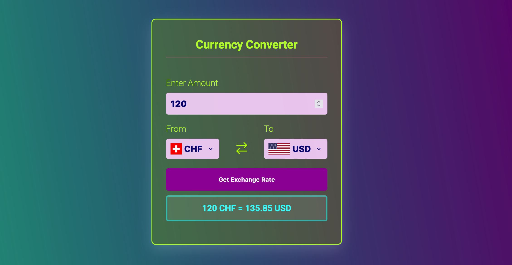

# Currency Converter


A React-based currency conversion tool that fetches real-time exchange rates using the [ExchangeRate-API](https://www.exchangerate-api.com) 👈 .\
Users can input an amount, select source and target currencies, and instantly see the converted result.\
Built with React hooks and a clean UI, it’s perfect for quick conversions or as a starting point for more complex financial tools.

## Features

➡️ **Dynamic Conversion:** Enter an amount and convert between two currencies with real-time exchange rates.\
➡️ **Currency Switching:** Swap "From" and "To" currencies with a single click using the arrow icon.\
➡️ **Real-Time Data:** Fetches exchange rates via the [ExchangeRate-API v6](https://www.exchangerate-api.com) 👈 .\
➡️ **Responsive Form:** Includes input validation and a clean, user-friendly interface.\
➡️ **Initial Load:** Automatically fetches the exchange rate for a default USD-to-CHF conversion.

## Installation

1. Clone the repository and navigate to it :

   ```bash
   git clone https://github.com/tpreisig/currency-converter.git
   cd currency-converter
   ```

2. Install the dependencies:

   ```bash
   npm install
   ```

3. Add your API key:
   - Create a `.env` file in the root directory
   - Add your key `VITE_API_KEY=your_api_key`
  
4. Start the development server:

   ```bash
   npm run dev
   ```

## Usage

➡️ Enter amount in input field\
➡️ Use the dropdowns to select "From" and "To" currencies\
➡️ To reverse the currencies selected click the swap icon\
➡️ Hit the button to see the result, or let it load automatically on first render

## Code Overview

- **State Management:** Uses `useState` for `amount`, `fromCurrency`, and `toCurrency`, and `result`.
- **API Fetching:** An async function `getExchangeRate` retrieves currency rates and updates `result`.
- **Effect Hook:** First fetch is triggered by `useEffect` on mount.
- **Event Handling:** Currency swap and form submission are handled with clean and reusable logic.

## License

This project is licensed under the MIT License - see the [LICENSE](LICENSE) file for details.


## Images



## Contact

Maintained by tpreisig - feel free to reach out!


