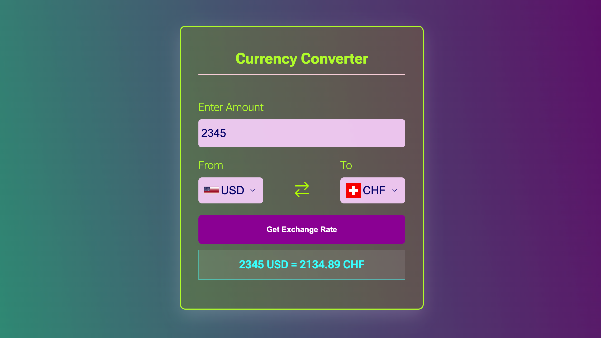

# Currency Converter


Webapplication to convert between different currencies. The application's GUI let's you conveniently choose all currencies by the currency code, and displays exchange rate and countries flags.


## Installation

1. Clone the repository:
   ```bash
   git clone https://github.com/tpreisig/currency-converter.git
   ```
2. Navigate to the project directory:
   ```bash
   cd currency-converter
   ```
3. Install dependencies:
   ```bash
   npm install
   ```

## Usage

To start the application, run:
```bash
npm run dev
```

## License

This project is licensed under the MIT License - see the [LICENSE](LICENSE) file for details.


## Images



## Contact

Maintained by tpreisig - feel free to reach out!


